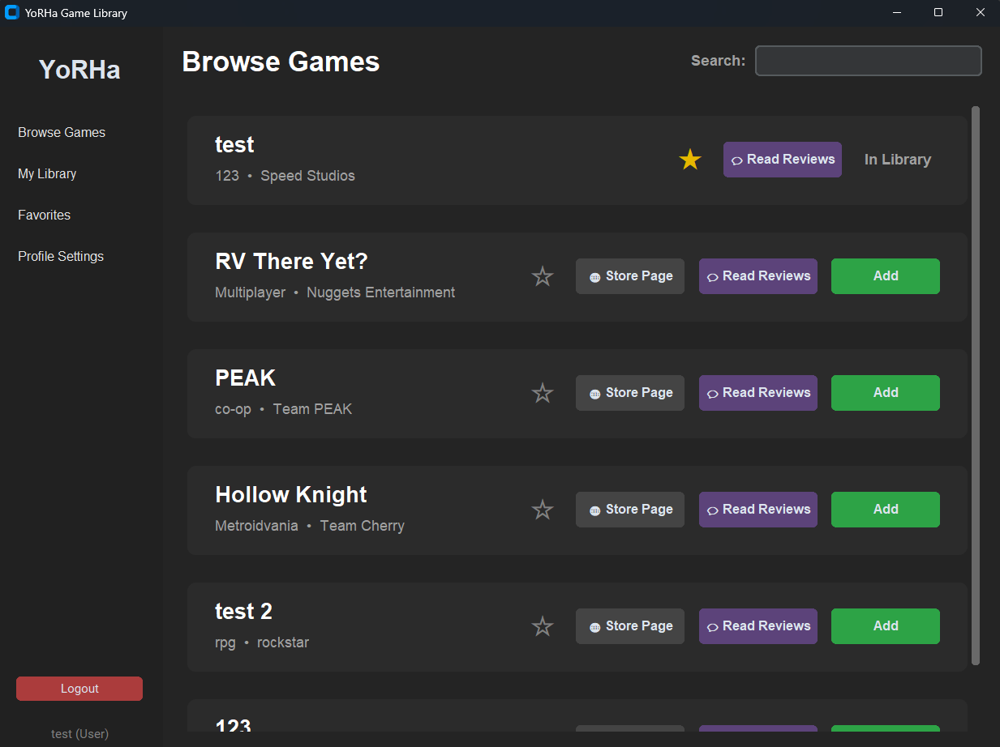
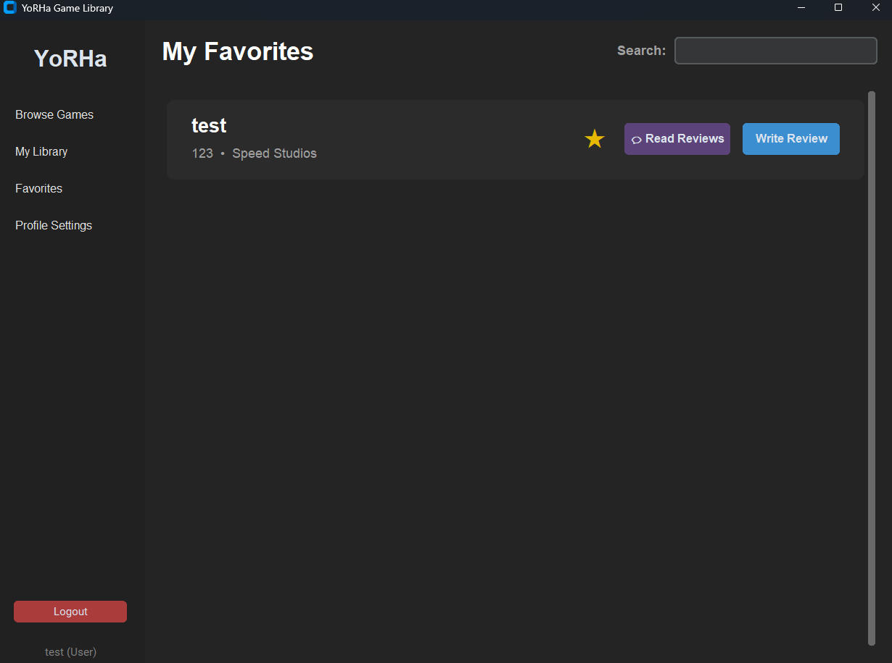
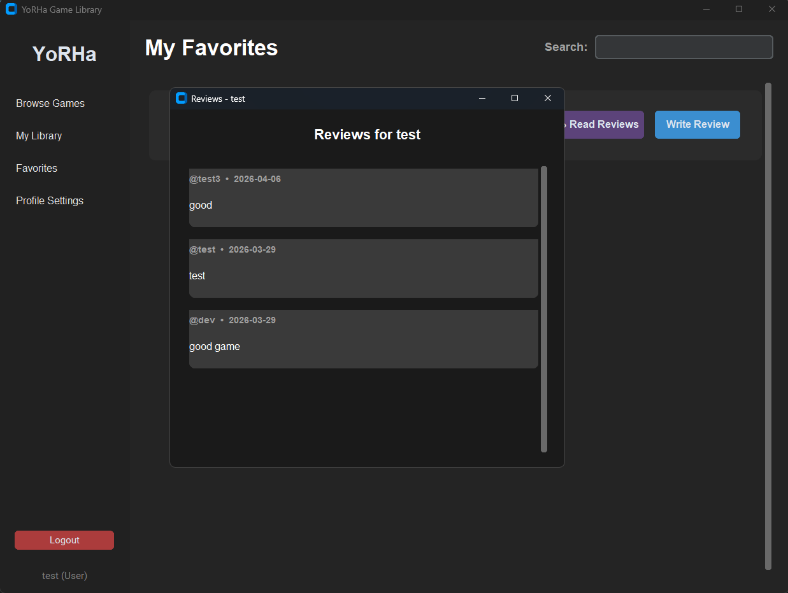

# YoRHa Game Library

A sleek, dark-themed desktop application for managing your personal game collection — built with Python, CustomTkinter, and MySQL.


---

## Features

- **User Authentication** — Register and log in with username/password; supports regular users and admin/developer accounts
- **Browse Games** — View the full game catalogue with developer info, live search filtering by title or genre
- **My Library** — Track games you own
- **Favorites** — Star games to keep a personal favourites list
- **Reviews** — Read community reviews and write your own for games in your library
- **Admin Panel** — Developer accounts can add new games to the database, including genre, studio, and store link
- **Profile Settings** — Update your username, email, and password at any time
- **Threaded DB calls** — All database fetches run in background threads to keep the UI responsive
- **Centralised SQL** — All queries live in `queries.sql` and are loaded at startup, keeping Python code clean

---

## Screenshots





---

## Project Structure

```
yorha-game-library/
├── screenshots  
├── main.py          # Application entry point & all UI logic
├── queries.sql      # Every SQL query used by the app, named and centralised
├── table-creation.sql 
└── README.md
```

---

## Prerequisites

- Python 3.8+
- MySQL Server 8.x
- pip packages:
  - `customtkinter`
  - `mysql-connector-python`

---

## Getting Started

### 1. Clone the repository

```bash
git clone https://github.com/your-username/yorha-game-library.git
cd yorha-game-library
```

### 2. Install dependencies

```bash
pip install customtkinter mysql-connector-python
```

### 3. Set up the database

Create a MySQL database and the required tables:

```sql
CREATE DATABASE game_library_db;
USE game_library_db;

CREATE TABLE users (
    user_id      INT AUTO_INCREMENT PRIMARY KEY,
    username     VARCHAR(50)  UNIQUE NOT NULL,
    password     VARCHAR(255) NOT NULL,
    email        VARCHAR(100) UNIQUE,
    is_developer BOOLEAN DEFAULT FALSE
);

CREATE TABLE developers (
    developer_id INT AUTO_INCREMENT PRIMARY KEY,
    name         VARCHAR(100) UNIQUE NOT NULL
);

CREATE TABLE games (
    game_id      INT AUTO_INCREMENT PRIMARY KEY,
    title        VARCHAR(150) NOT NULL,
    genre        VARCHAR(80),
    price        DECIMAL(6,2) DEFAULT 0.00,
    developer_id INT,
    link         VARCHAR(500),
    FOREIGN KEY (developer_id) REFERENCES developers(developer_id)
);

CREATE TABLE owned_games (
    user_id INT,
    game_id INT,
    PRIMARY KEY (user_id, game_id),
    FOREIGN KEY (user_id) REFERENCES users(user_id),
    FOREIGN KEY (game_id) REFERENCES games(game_id)
);

CREATE TABLE favorite_games (
    user_id INT,
    game_id INT,
    PRIMARY KEY (user_id, game_id),
    FOREIGN KEY (user_id) REFERENCES users(user_id),
    FOREIGN KEY (game_id) REFERENCES games(game_id)
);

CREATE TABLE reviews (
    review_id   INT AUTO_INCREMENT PRIMARY KEY,
    user_id     INT,
    game_id     INT,
    review_text TEXT,
    review_date TIMESTAMP DEFAULT CURRENT_TIMESTAMP,
    FOREIGN KEY (user_id) REFERENCES users(user_id),
    FOREIGN KEY (game_id) REFERENCES games(game_id)
);
```

### 4. Configure database credentials

Open `main.py` and update the `db_config` block near the top:

```python
db_config = {
    'host': '127.0.0.1',
    'user': 'your_mysql_user',
    'password': 'your_mysql_password',
    'database': 'game_library_db'
}
```

### 5. Run the app

```bash
python main.py
```

---

## User Roles

| Role  | Capabilities |
|-------|-------------|
| User  | Browse, add to library, favourite, review |
| Admin | Everything above + add new games to the database |

To create an admin account, check the **"Register as Admin / Dev account"** checkbox on the registration screen.

---

## How Queries Work

All SQL lives in `queries.sql`, tagged with named markers:

```sql
-- [login]
SELECT * FROM users WHERE username = %s AND password = %s;
```

On startup, `main.py` parses this file into a dictionary `Q`. Queries are then called by name anywhere in the app:

```python
cursor.execute(Q["login"], (username, password))
```

This keeps SQL out of the Python source and makes it easy to review, edit, or optimise queries in one place.

---

## Contributing

Pull requests are not welcome! this is a mini-Project for college and it is complete and no further update is in work.

---

## License

This project is licensed under the [MIT License](LICENSE).
